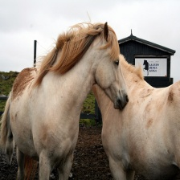

# Precision Image Captioning: Enhancing Descriptive Accuracy

## Abstract
The goal of this project is to improve the quality of image captioning models. We propose a novel approach to image captioning that uses pretrained image captioning models to generate a caption for an image, and then uses an ensemble of LLMs and VQA models to generate a new caption that is enriched with details and is upto $7x$ more descriptive than SOTA models. We provide a web application that allows users to upload images, generate captions using our model and ask any question to our model.

## Models and APIs
### Image Captioning
- BLIP
- GIT
- Custom Bi-GRU VQA model

### Large-Language Model ([Replicate API](https://replicate.com/meta/llama-2-70b-chat/api?tab=nodejs))
- LLaMA-2-70B
- Mistral-7B

### User Interface
- Streamlit

## Results
 Input Image | BLIP | GIT | Our Model+BLIP | Our Model+Bi-GRU | 
:-------------------------:|:-------------------------:|:-------------------------:|:-------------------------:|:-------------------------:
 | a photograph of a dog sleeping on a couch|a dog is sleeping on the back seat of a car|[Result 1](./results/img_20_1.md)|[Result 2](./results/img_20_2.md)|
|a photograph of two horses standing in a field| two white horses standing next to each other| [Result 1](./results/img_24_1.md) |[Result 2](./results/img_24_2.md)|


## Running Custom Model
### Model Download
To run our model, you will need to download the files in this google drive folder: [Model folder](https://drive.google.com/drive/folders/1oz2Jd2Mz7uHh82SrrkYeMrmesfW4QYQ2?usp=sharing). Then after the files have been installed put them in the `./models/resources ` directory. The other models are automatically downloaded in code or are on api calls.

### Environment
We recommend setting up an environment in python with venv to run our code and install the pip packages needed this can be done with the following lines in the terminal (except windows):
```
python3 -m venv env
```
```
source ./env/bin/activate
```
```
pip install -r requirements.txt
```
Otherwise, you are welcome to read the modules in requirements.txt and install manually.

## Running the App

To run our app, run the following line of code from the main directory of the project

```
python -m streamlit run ui/app.py
```
The first time the applicaton is started the BLIP and GIT models will be downloaded. This will take some time. After they are done they get cached in a directory named hugging face in the home directory on linux so that the start up next time is quicker. Each run of the model uses a free API key that we get from replicate that runs out every so often. One key is in this repo, but if it runs out, go to the following link to make an account with a free token: [Replicate](https://replicate.com). Then replace the `replicate_api_key` variable in `/ui/app.py` to your new key.
